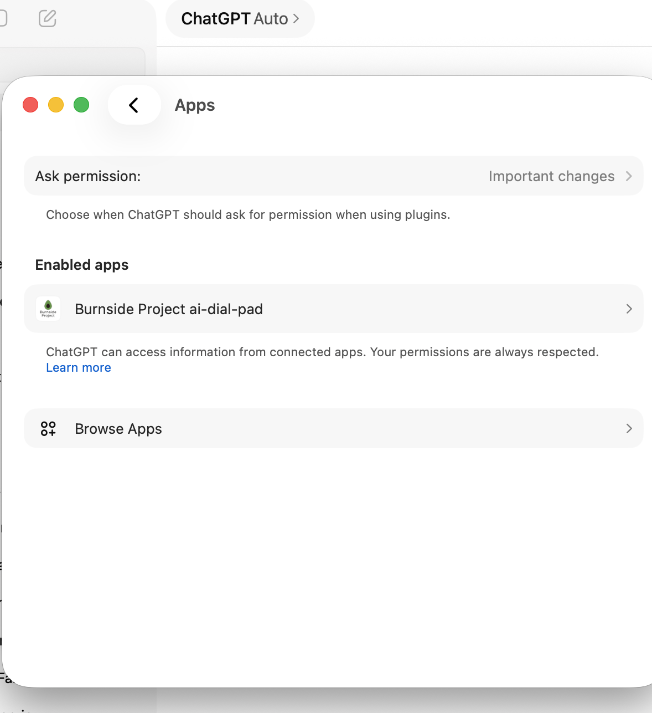
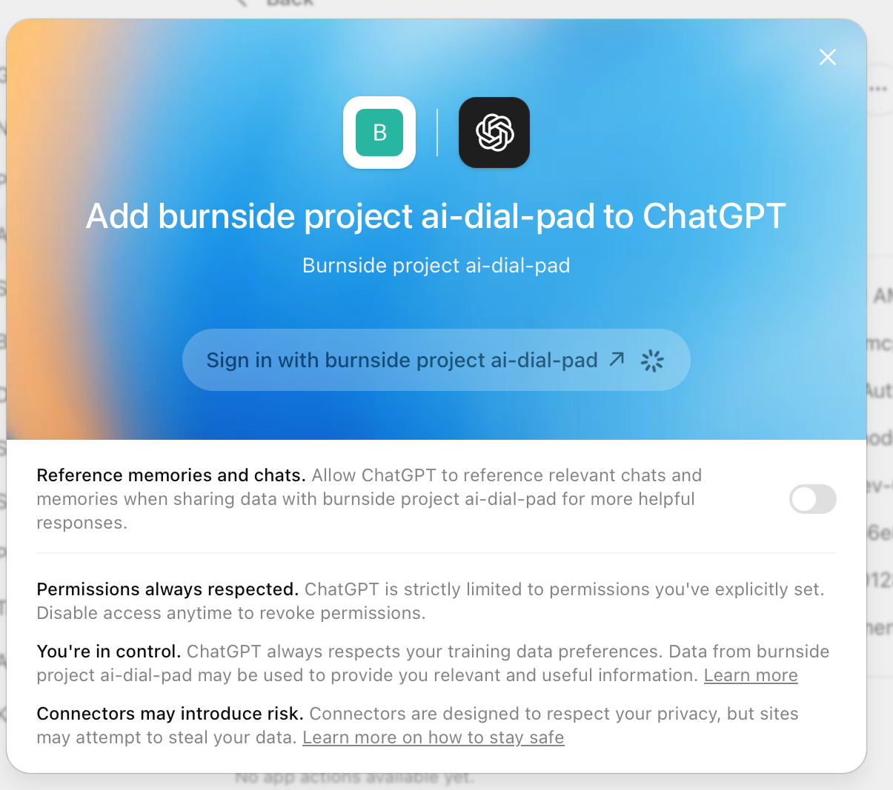
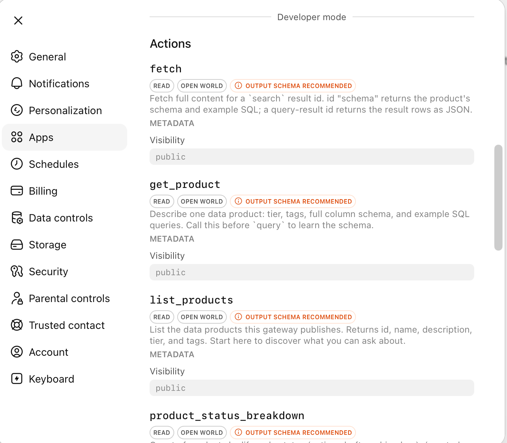
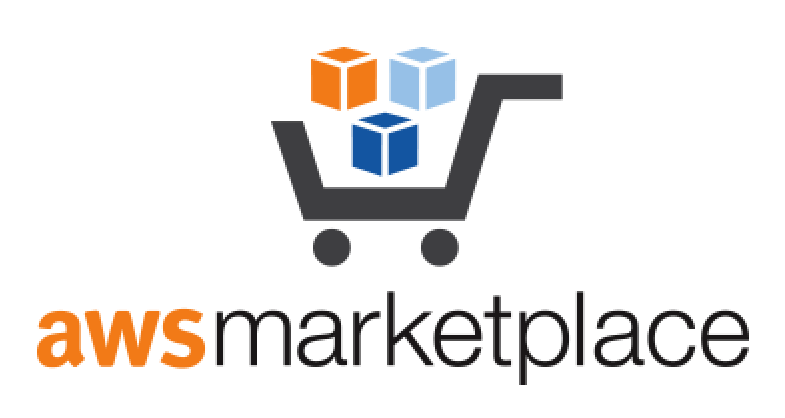
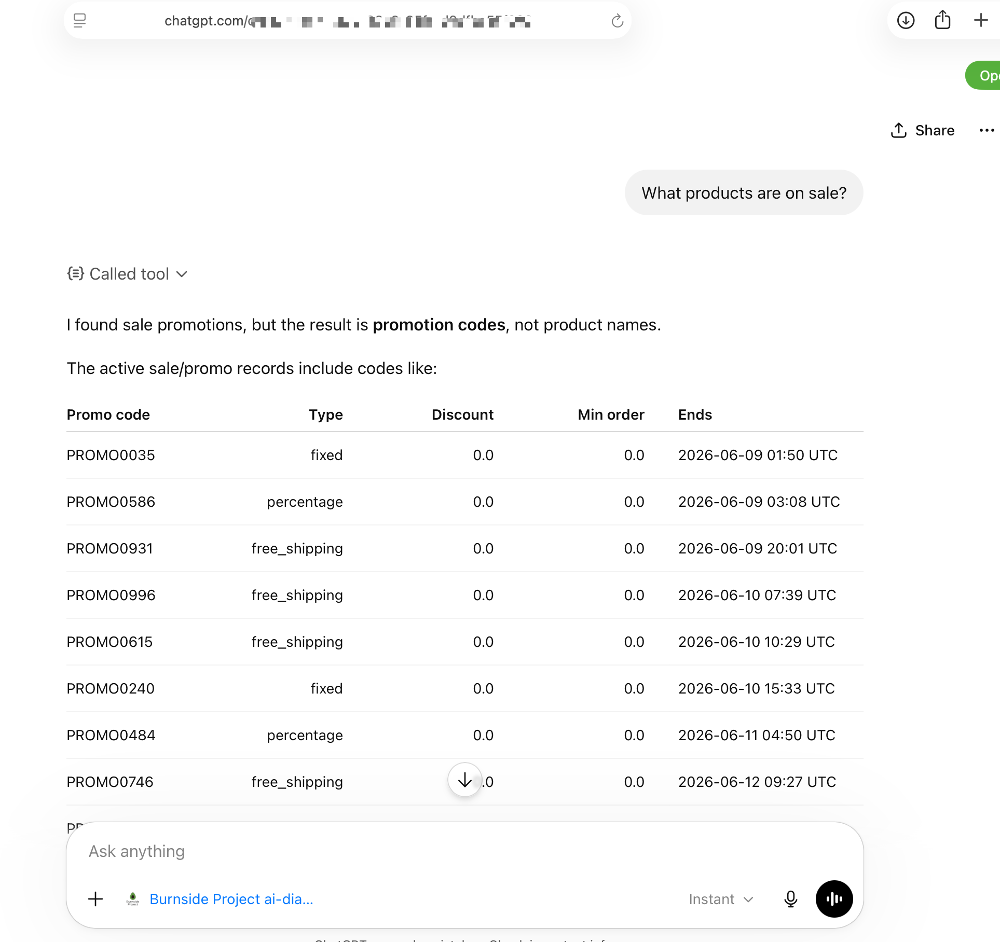
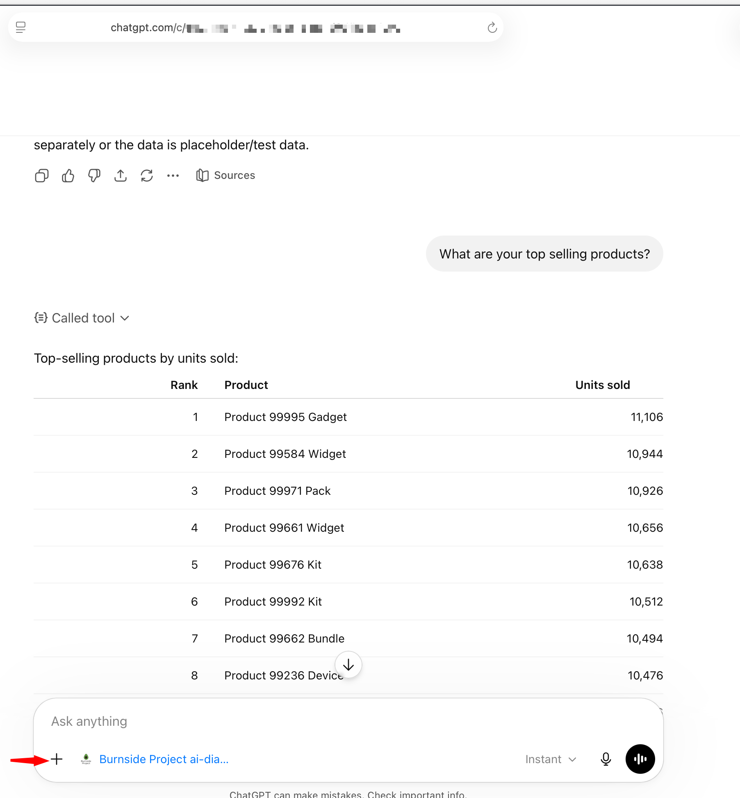

# What is ai-dial-pad ?

  

**Publish governed operational data as AI-agent-ready MCP endpoints.**

ai-dial-pad lets teams expose trusted business context to ChatGPT, Claude, and internal AI agents without giving agents direct access to production databases.

It creates a physical and architectural separation between production data and AI agents.

### Key Capabilities

- Publish governed operational data as MCP endpoints

- Expose trusted business context to ChatGPT, Claude, and internal AI agents

- Keep AI agents away from production databases

- Create a physical separation between production systems and AI access

- Serve AI agents from governed snapshots, not live transactional systems

- Support air-gapped AI access patterns

- Provide auditable access to operational context

- Enforce governance, identity, and access policies

- Reduce risk of accidental production data exposure

- Enable customer support, operations, analytics, and AI workflows

  

---
### Registers Tools on MCP server

  

  
   
  <strong>Coming Soon on AWS Marketplace</strong>

## What problem it solves

AI agents need business context:

- orders

- customers

- products

- subscriptions

- inventory

- operational events

But they should not connect directly to production PostgreSQL.

ai-dial-pad publishes governed, audited, read-only operational context as discoverable MCP tools.

## Product flow

PostgreSQL

→ pg-cdc

→ Governed Lake

→ Business Entities

→ ai-dial-pad MCP Gateway

→ ChatGPT / Claude / AI Agents

## Example

Paste:

`https://dial.burnside.ai/p/acme-orders`

Then ask:

“Is product X in stock?”

The agent answers from governed operational context, not the production DB.

## Who it is for

- SaaS companies

- Data engineering teams

- AI platform teams

- Customer support automation teams

- Enterprises adopting AI agents

## Deployment model

Runs in the customer cloud account.

Customer data stays in the customer environment.

Burnside license service handles activation only.

## Security model

- No direct production DB access for agents

- Read-only governed context

- IAM / Lake Formation / policy-based access

- Audit trail for agent queries

- Optional customer-managed deployment

## Start here

- Product overview

- Architecture

- Use cases

- AWS Marketplace

- Book a demo

---
### Promot inside your Chatgpt Client

  

---
### Query inside your Chatgpt Client

  

---
## Visiblity
> This is a private repo. If you want to see a demo how you can create AI Agent tools so your end customers can start a Q/A with your backend governed data - schedule a meeting.

> <a href="https://calendar.google.com/calendar/appointments/schedules/AcZssZ0jW4tXS9oprMT773HT843ndiFdPXAK7pro0FhX3mCpVWyYE0Y0adsAe-cPVrVSqrQ0Bm2n4cPS" >Book a Demo</a>

Publish governed data products as **dial-able tiny-URL MCP endpoints** — paste the URL into Claude or ChatGPT Enterprise and start a governed, audited conversation with your data.

> Like publishing a phone number for your data: you publish a "number" (a tiny URL); users **dial in** from their AI client and converse.
>
> `https://dial.burnside.ai/p/acme-orders` → pasted into a chatbox → connected → *"Is product X in stock?"* → answered from the governed lake.

## What it is

ai-dial-pad turns **governed data products on an AWS S3 lake** — into publishable, conversational MCP endpoints. It's **producer-agnostic**: the contract is the governed lake, not any one writer, so it works on any LF-governed, Glue-cataloged S3 data.

